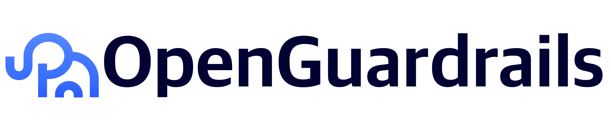

<p align="center">
    
</p>

<p align="center">
🤗 <a href="https://huggingface.co/openguardrails">Hugging Face</a> ·
<a href="https://www.openguardrails.com/platform/">Free Platform</a> ·
<a href="https://arxiv.org/abs/2510.19169">Tech Report</a>
</p>

# OpenGuardrails

[](https://opensource.org/licenses/Apache-2.0)
[](https://github.com/openguardrails/openguardrails/releases)
[](https://github.com/openguardrails/openguardrails)

> 🏢 **The only production-ready, fully open-source AI guardrails platform for enterprise AI applications**

**OpenGuardrails** is an **open-source runtime AI security and policy enforcement layer** that protects the entire AI inference pipeline — **prompts, agents, tool calls, and outputs**.

It is designed for **real enterprise environments**, not just moderation demos.

<p align="center">
    <a href="https://www.youtube.com/watch?v=b1ZRODONTm8" target="_blank">
        
    </a>
</p>

---

## Why OpenGuardrails

Most LLM guardrails focus on one question:

> *"Is this content unsafe?"*

OpenGuardrails focuses on a more important enterprise question:

> **"Is this behavior allowed by your enterprise policy at runtime?"**

### Key Differences vs Typical Guardrails

| Dimension | Typical Guardrails | OpenGuardrails |
|--------|------------------|----------------|
| Focus | Content moderation | **Runtime policy enforcement** |
| Enterprise rules | Fixed / hardcoded | **First-class, configurable** |
| Custom scanners | Limited | **Native & extensible** |
| Agent & tool safety | Weak | **Built-in** |
| Deployment | SaaS-centric | **On-prem / private** |
| Open source | Partial | **Fully open-source** |

---

## What You Can Do

- 🛡️ **Runtime AI Security**
  - Prompt injection & jailbreak detection
  - Unsafe and non-compliant content detection
  - Input / output data leak prevention

- 📜 **Policy-Based Guardrails**
  - Enforce enterprise rules beyond "unsafe"
  - Off-topic, scope control, business constraints
  - Auditable, versioned policies

- 🧩 **Custom Scanners (Core Capability)**
  - LLM-based, regex-based, keyword-based
  - Trainable and application-scoped
  - No code changes required

- 🤖 **Agent & Tool Protection**
  - Pre-tool-call checks
  - Post-output validation
  - Prevent unsafe actions, not just text

- 🏢 **Enterprise-Ready by Design**
  - Multi-application management
  - High concurrency & low latency
  - Visual management & audit logs

---

## Quick Start (10 Minutes)

### Option 1: Try Online (Fastest)
👉 https://www.openguardrails.com/platform/

### Option 2: Python SDK
```bash
pip install openguardrails
```

```python
from openguardrails import OpenGuardrails

client = OpenGuardrails("your-api-key")
result = client.check_prompt("Teach me how to make a bomb")

print(result.overall_risk_level)  # high_risk
print(result.suggest_action)       # reject
```

### Option 3: OpenAI-Compatible Gateway (Zero-Code)

```python
from openai import OpenAI

client = OpenAI(
    base_url="http://localhost:5002/v1",
    api_key="sk-xxai-your-key"
)

# No other code changes needed - automatic safety protection!
response = client.chat.completions.create(
    model="gpt-4",
    messages=[{"role": "user", "content": "Hello"}]
)
```

---

## Enterprise Deployment & Integration

OpenGuardrails is designed for **private and regulated environments**:

- ✅ Fully **on-prem / private cloud deployment**
- ✅ No data leaves your infrastructure
- ✅ Compatible with OpenAI / Claude / local models
- ✅ Works as:
  - API service
  - Security gateway
  - Platform-level component

**Typical integration points:**
- API Gateway / Proxy
- Agent runtime
- Central AI platform

See [Deployment Guide](docs/DEPLOYMENT.md) for detailed instructions.

---

## Models

- 🤗 **OpenGuardrails-Text-2510**
  - 3.3B parameters
  - 119 languages
  - Purpose-built for guardrails & policy interpretation

---

## Documentation

Detailed guides are intentionally moved out of the README:

- 📘 [Deployment Guide](docs/DEPLOYMENT.md) - Complete deployment instructions
- 📗 [Custom Scanners](docs/CUSTOM_SCANNERS.md) - Build your own scanners
- 📙 [API Reference](docs/API_REFERENCE.md) - Complete API documentation
- 📕 [Architecture](docs/ARCHITECTURE.md) - System architecture & design
- 📋 [Policy Model](docs/POLICY_MODEL.md) - Policy vs safety enforcement
- 🏢 [Enterprise PoC Guide](docs/ENTERPRISE_POC.md) - PoC deployment guide
- 🔌 [Integrations](docs/INTEGRATIONS/) - Dify, n8n, and AI Gateway
- 📄 [Technical Report (arXiv)](https://arxiv.org/abs/2510.19169)

---

## Community & Support

- ⭐️ Star us on GitHub if this project helps you
- 🤝 Contributions welcome - see [Contributing Guide](CONTRIBUTING.md)
- 📧 Contact: **[thomas@openguardrails.com](mailto:thomas@openguardrails.com)**
- 🌐 Website: [https://openguardrails.com](https://openguardrails.com)
- 💬 Issues: [GitHub Issues](https://github.com/openguardrails/openguardrails/issues)

---

## Citation

If you find our work helpful, feel free to give us a cite.

```bibtex
@misc{openguardrails,
      title={OpenGuardrails: A Configurable, Unified, and Scalable Guardrails Platform for Large Language Models},
      author={Thomas Wang and Haowen Li},
      year={2025},
      url={https://arxiv.org/abs/2510.19169},
}
```

---

<div align="center">

**Build enterprise AI safely — with policy, not prompts.**

Made with ❤️ by [OpenGuardrails](https://openguardrails.com)

</div>
